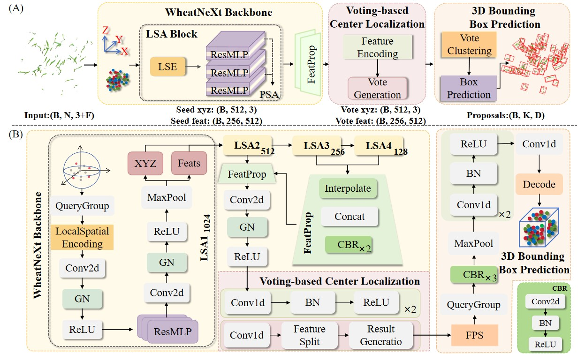

# WheatNet3D

This repository provides the core architecture implementation of **WheatNet3D**, a 3D point cloud-based model for wheat seedling detection and structural phenotyping.

## 🔧 Model Architecture

The following components of the model are provided:

* WheatNeXt Backbone
* Voting-based Center Localization Module
* 3D Bounding Box Prediction Head

## 📦 Example Data

A representative sample of the dataset is provided in the `example_data/` directory, including:

* A point cloud file (`.ply`)
* Its corresponding annotation file (`.txt`, KITTI format)

These files are intended to illustrate the data format and annotation scheme used in this study.
